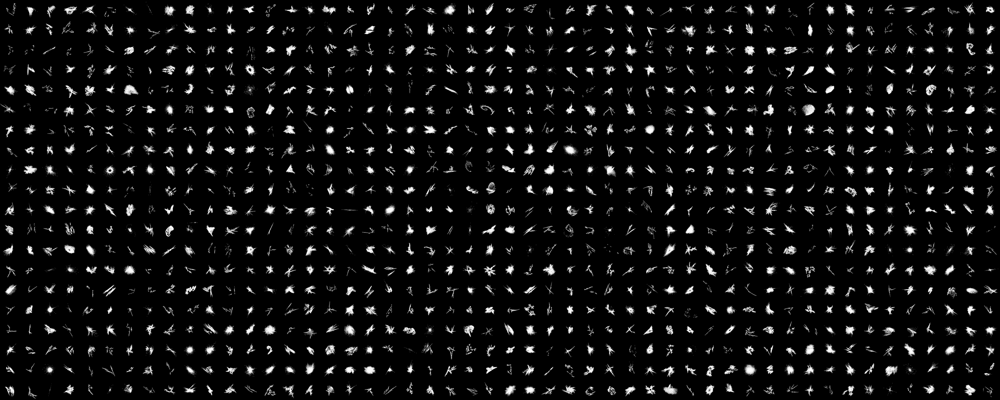

# 3D-OFDB (One-instance FractalDataBase)

<p align="center">  <p align="center">These images are the full set of images rendered from a single 3D-OFDB-1k viewpoint.</p>

## Summary

In this repository, you can construct a dataset of 3D-OFDB. To create 3D-OFDB, perform a Fractal Category Search and create a 3D model. The 3D-OFDB is formed by rendering images from an arbitrary number of viewpoints from the 3D model. The number of viewpoints at this time becomes a variation of data augmentation.

## Requirements

* Python 3.x (worked at 3.7.0)


1. Create anaconda virtual environment.
```d
$ conda create -n 3d-ofdb python=3.7.0 -y
$ conda activate 3d-ofdb
```

2. Install requirement modules
```
$ conda install -c conda-forge openexr-python
$ pip install -r requirements.txt
```

## Running the code

We prepared execution file 3d-ofdb_render.sh in the top directory. 
The execution file contains our recommended parameters. 
Please type the following commands on your environment. 
You can execute the fractal category search, the 3D fractal model generate, and the multi-view image render, MV-FractalDB Construction.

```bash 
$ bash 3d-ofdb_render.sh
```

The folder structure is constructed as follows.

```misc
./
  3D-OFDB-{category}/
    3DIFS_param/
          000000.csv
          000001.csv
          ...
    3Dmodel/
          000000/
          000000_0000.ply
          000001/
          000000_0000.ply
          ...
        ...
    images/
          000000/
          000000_00000_000.png
          000000_00000_001.png
          ...
        ...
```
Files corresponding to the number of image viewpoints will be created.
During Pre-training, one image from the arbitrary viewpoints generated here is trained per epoch.

## Acknowledgements
The 3D-OFDB generation code is based on [MV-FractalDB](https://github.com/ryosuke-yamada/3dfractaldb).