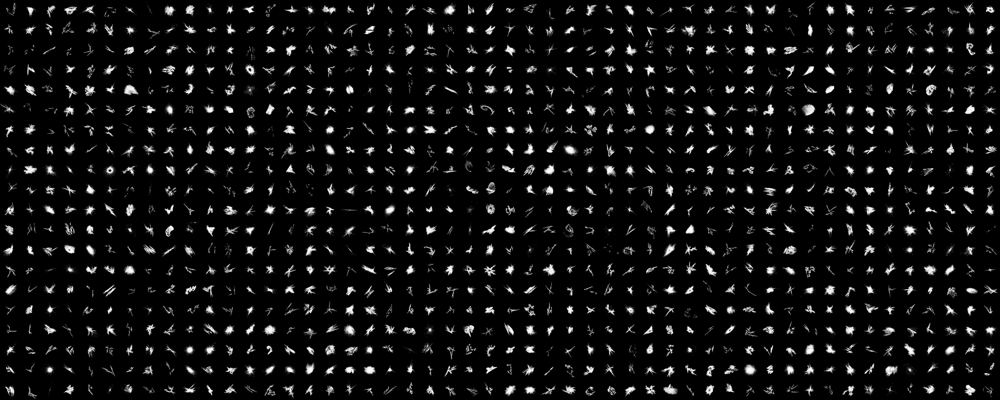

# Pre-training Vision Transformers with Very Limited Synthesized Images (ICCV'23)

## Summary
The repository contains 2D/3D-OFDB dataset Construction, Pre-training and Fine-tuning in Python/PyTorch. <br> 
The repository is based on the paper: Ryo Nakamura, Hirokatsu Kataoka, Sora Takashima, Edgar Josafat MARTINEZ-NORIEGA, Rio Yokota and Nakamasa Inoue,
"Pre-training Vision Transformers with Very Limited Synthesized Images", IEEE/CVF International Conference on Computer Vision (ICCV) 2023.
[[Project](https://masora1030.github.io/Visual-Atoms-Pre-training-Vision-Transformers-with-Sinusoidal-Waves/)] 
[[PDF](xxx)] 
[[Dataset](#one-instance-fractaldatabase(ofdb))] 
<!-- [[Poster](https://cvpr2023.thecvf.com/media/PosterPDFs/CVPR%202023/22854.png?t=1685632285.9741583)]  -->
<!-- [[Supp](https://masora1030.github.io/Visual-Atoms-Pre-training-Vision-Transformers-with-Sinusoidal-Waves/CVPR2023_VisualAtom_FDSL_Supplementary_Material.pdf)] -->

<p align="center">  <p align="center">Fine-tuning accuracy on CIFAR-100 for the number of images for pre-training. The line plot for ImageNet-1k indicates the results when using random sampling to reduce the data for pre-training. (b) One-instance fractal database (OFDB) consists of only 1,000 images in total. The figure shows the category representation. OFDB contains a single instance per category.</p>

```bibtex
@InProceedings{nakamura2023ofdb,
    author    = {Ryo Nakamura, Hirokatsu Kataoka, Sora Takashima, Edgar Josafat MARTINEZ-NORIEGA, Rio Yokota and Nakamasa Inoue},
    title     = {Pre-training Vision Transformers with Very Limited Synthesized Images},
    booktitle = {Proceedings of the IEEE/CVF Conference on Computer Vision (ICCV)},
    month     = {Octorber},
    year      = {2023},
    pages     = {xxx}
}
``` 

## One-instance FractalDataBase(OFDB)
もし，あなたが2D/3D-OFDB-1k or 21kを使用したいのであれば，以下のDownload linkからダウンロードしてください．
2D-OFDB-1kと21kについては，pngをtar.gzに圧縮したファイルを提供いたします．
3D-OFDB-1kと21kについては，任意視点からのデータ拡張（レンダリング）のために，3Dmodelを共有いたします．
3D-OFDBの生成コードが3d-ofdb-gereratorディレクトリに保管してあるので，そちらのREADMEを参照してください．

|  |  |
|:---:|:---:|
| Download link : [[2D-OFDB-1k](https://masora1030.github.io/Visual-Atoms-Pre-training-Vision-Transformers-with-Sinusoidal-Waves/)]  [[2D-OFDB-21k](https://masora1030.github.io/Visual-Atoms-Pre-training-Vision-Transformers-with-Sinusoidal-Waves/)]   |Download link : [[3D-OFDB-1k](https://masora1030.github.io/Visual-Atoms-Pre-training-Vision-Transformers-with-Sinusoidal-Waves/)] [3D-OFDB-21k](https://masora1030.github.io/Visual-Atoms-Pre-training-Vision-Transformers-with-Sinusoidal-Waves/)] |

## 2D-OFDB ([README](visual_atomic_renderer/README.md))
2D-OFDBのデータ生成を行いたい場合は，2D-OFDBのREADMEを参照のうえ，以下のコマンドを実行してください．

```
$ cd visual_atomic_renderer
$ bash make_VisualAtom.sh
```

You can also download raw 2D-OFDB-1k here : [zenodo](https://zenodo.org/record/7945009)

## 3D-OFDB ([README](xxxx))

3D-OFDBのデータ生成を行いたい場合は，3D-OFDBのREADMEを参照のうえ，以下のコマンドを実行してください．

```
$ cd 3d-ofdb-generator
$ bash make_VisualAtom.sh
```


<style>
table, th, td {
  border: none;
}
</style>


## Requirements
ここでは，生成した2D/3D-OFDBをpre-trainingまたは，Pre-trainined modelをfinetuningするのに必要な環境について紹介します．

* Python 3.x (worked at 3.8.2)
* CUDA (worked at 10.2)
* CuDNN (worked at 8.0)
* NCCL (worked at 2.7)
* OpenMPI (worked at 4.1.3)
* Graphic board (worked at single/four NVIDIA V100)

Please install packages with the following command.

```bash
$ pip install --upgrade pip
$ pip install -r requirements.txt
```


## Pre-training

We used almost the same scripts as in [Kataoka_2022_CVPR](https://github.com/masora1030/CVPR2022-Pretrained-ViT-PyTorch) for our pre-training.

Run the shell script ```pre-traning.sh```, you can pre-train with 2D or 3D-OFDB.

Basically, you can run the python script ```pretrain.py``` with the following command.

- Example : with deit_base, pre-train 2d-ofdb-1k, 4 GPUs (Batch Size = 64×4 = 256)

    ```bash
    $ mpiexec -npernode 4 -np 8 python -B main.py data=grayimagefolder \
                data.baseinfo.name=2d-ofdb-1k \
                data.baseinfo.train_imgs=1000 data.baseinfo.num_classes=1000 \
                data.trainset.root=PATH/TO/TRAINDATA \
                data.loader.batch_size=32 data.transform.no_aug=False \
                data.transform.auto_augment=rand-m9-mstd0.5-inc1 \
                data.transform.re_prob=0.5 data.transform.color_jitter=0.4 \
                data.transform.hflip=0.5 data.transform.vflip=0.5 \
                data.transform.scale=[0.08,1.0] data.transform.ratio=[0.75,1.3333] \
                data.mixup.prob=1.0 data.mixup.mixup_alpha=0.8 \
                data.mixup.cutmix_alpha=1.0 data.mixup.switch_prob=0.5 model=vit \
                model.arch.model_name=vit_tiny_patch16_224 model.optim.learning_rate=0.001 \
                model.scheduler.args.warmup_epochs=5 logger.group=cpmpare_instance_augmentation \
                logger.save_epoch_freq=10000 epochs=80000 mode=pretrain \
                output_dir=PATH/TO/OUTPUT
    ```

    > **Note**
    > 
    > - ```--batch-size``` means batch size per process. In the above script, for example, you use 4 GPUs (2 process), so overall batch size is 8×32(=256).
    > 
    > - In our paper research, for datasets with more than 1k categories, we basically pre-trained with overall batch size of 256 (8×32).
    > 
    > - If you wish to distribute pre-train across multiple nodes, the following must be done.
    >   - Set the `MASTER_ADDR` environment variable which is the IP address of the machine in rank 0.
    >   - Set the ```-npernode``` and ```-np``` arguments of ```mpirun``` command.
    >     - ```-npernode``` means GPUs (processes) per node and ```-np``` means overall the number of GPUs (processes).

Or you can run the job script ```scripts/pretrain.sh``` (support multiple nodes training with OpenMPI). 
Note, the setup is multiple nodes and using a large number of GPUs (2 nodes and 8 GPUs for pre-train).

When running with the script above, please make your dataset structure as following.

```misc
/PATH/dataset/2d-ofdb-1k/
    image/
        00000/
          xxxxx.png
        00001/
          xxxxx.png
        ...
        ...
    ...
```


Please see the script and code files for details on each arguments.


### Pre-trained models

Our pre-trained models are available in this [[Link](https://drive.google.com/drive/folders/1OUSmOt01K-nDsr55-w1YweGDfsVtgz4N?usp=share_link)].

We have mainly prepared three different pre-trained models. 
These pre-trained models are ViT-Tiny/Base (patch size of 16, input size of 224) pre-trained on VisualAtom-1k/21k and Swin-Base (patch size of 7, window size of 7, input size of 224) pre-trained on VisualAtom-21k.

```misc
vit_tiny_with_visualatom_1k.pth.tar: timm model is deit_tiny_patch16_224, pre-trained on VisualAtom-1k
vit_base_with_visualatom_21k.pth.tar: timm model is deit_base_patch16_224, pre-trained on VisualAtom-21k
swin_base_with_visualatom_21k.pth.tar: timm model is swin_base_patch4_window7_224, pre-trained on VisualAtom-21k
```

## Fine-tuning

We used fine-tuning scripts based on [Nakashima_2022_AAAI](https://github.com/nakashima-kodai/FractalDB-Pretrained-ViT-PyTorch).

Run the python script ```finetune.py```, you additionally train other datasets from your pre-trained model.

In order to use the fine-tuning code, you must prepare a fine-tuning dataset (e.g., CIFAR-10/100, ImageNet-1k, Pascal VOC 2012). 
You should set the dataset as the following structure.

```misc
/PATH/TO/DATASET/
  train/
    class1/
      img1.jpeg
      ...
    class2/
      img2.jpeg
      ...
    ...
  val/
    class1/
      img3.jpeg
      ...
    class2/
      img4.jpeg
      ...
    ...
```

Basically, you can run the python script ```finetune.sh``` with the following command.

- Example : with deit_base, fine-tune CIFAR10 from pre-trained model (with VisualAtom-21k), 8 GPUs (Batch Size = 96×8 = 768)

    ```bash
    $ mpiexec -npernode 4 -np 8 \
        python -B finetune.py data=colorimagefolder \
        data.baseinfo.name=CIFAR10 data.baseinfo.num_classes=10 \
        data.trainset.root=/PATH/TO/CIFAR10/TRAIN data.baseinfo.train_imgs=50000 \
        data.valset.root=/PATH/TO/CIFAR10/VAL data.baseinfo.val_imgs=10000 \
        data.loader.batch_size=96 \
        ckpt=./output/pretrain/pretrain_deit_base_VisualAtom21000_1.0e-3/last.pth.tar \
        model=vit model.arch.model_name=vit_base_patch16_224 \
        model.optim.optimizer_name=sgd model.optim.learning_rate=0.01 \
        model.optim.weight_decay=1.0e-4 model.scheduler.args.warmup_epochs=10 \
        epochs=1000 mode=finetune \
        logger.entity=YOUR_WANDB_ENTITY_NAME logger.project=YOUR_WANDB_PROJECT_NAME logger.group=YOUR_WANDB_GROUP_NAME \
        logger.experiment=finetune_deit_base_CIFAR10_batch768_from_VisualAtom21000_1.0e-3 \
        logger.save_epoch_freq=100 \
        output_dir=./output/finetune
    ```

Or you can run the job script ```scripts/finetune.sh``` (support multiple nodes training with OpenMPI).

Please see the script and code files for details on each arguments.

## Terms of use
The authors affiliated in National Institute of Advanced Industrial Science and Technology (AIST) and Tokyo Institute of Technology (TITech) are not responsible for the reproduction, duplication, copy, sale, trade, resell or exploitation for any commercial purposes, of any portion of the images and any portion of derived the data. In no event will we be also liable for any other damages resulting from this data or any derived data.

[def]: #summary